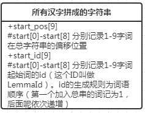
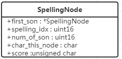
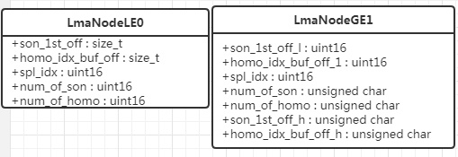
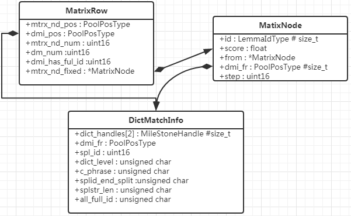
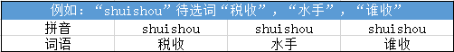
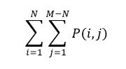

## 前言
> 最后看完其实还是蛮简单的，看代码看了半天都搞乱了，可以简单看下[总结](#conclusion)部分

本文主要对GooglePinyin Android输入法C++层的代码进行分析。目的是为了了解输入法引擎的基础数据结构及工作流程。
在研究之前先简单分析一下，对于一个基础拼音输入法，需要掌握的功能都有哪些：

**基础功能：**
1. 将一个长的拼音字符串切分为多个独立的拼音
2. 根据拼音展示可能的词语，并根据可能性从高按低排序展示
3. 支持组合模式输入即一次或多次输入，多次选择候选词，一次输出
4. 基础性能优化（例如增量查询，退格是常用的功能，所以增量查询是一个基础功能）

**进阶功能：**
1. 支持简拼（首字母模式）
2. 支持词语联想，例如在组合模式下，如果选定部分词语，则针对词语给出跟高优先级的候选词，增强词语联想功能
3. 支持用户特征词库，对用户输入过的词语进行记录。用户常用词有更高的优先级展示

**高级功能：**
1. 拼音纠错，对可能误输入的拼音展示可能正确的拼音输入结果
2. 语音输入
3. 手写输入
<!--more-->
## 词库原始数据
词库的原始数据形式如下
```
鼥 0.750684002197 1 ba
釛 0.781224156844 1 ba
軷 0.9691786136 1 ba
釟 0.9691786136 1 ba
蚆 1.15534975655 1 ba
...
斑斑 494.9767145 0 ban ban
版本 15935.9132976 0 ban ben
半杯 105.953760973 0 ban bei
半边 236.991986692 0 ban bian
斑驳 188.196293023 0 ban bo
...
请注意 887.99205879 0 qing zhu yi
青春痘 343.139741671 0 qing chun dou
青春期 536.070335228 0 qing chun qi
青城山 121.066816454 0 qing cheng shan
青少年 2406.4213017 0 qing shao nian
请稍候 125.36572391 0 qing shao hou
请使用 166.768626413 0 qing shi yong
...
二次开发 126.306596357 0 er ci kai fa
二氧化碳 532.740555233 0 er yang hua tan
二氧化硫 196.831399718 0 er yang hua liu
欧美国家 141.29744947 0 ou mei guo jia
欧洲国家 193.90988203 0 ou zhou guo jia
欧洲市场 170.551683166 0 ou zhou shi chang
```
1. 第一列是具体词语的汉字
2. 第二列是该词语的词频
3. 第三列是GBK mark，如果标记为1，会被舍弃（这个只在没有可用汉字表的情况下使用，默认情况是会有这个可用汉字表的，所以默认情况下这个值没有使用）
4. 之后的部分为词语的拼音

可用汉字的原始数据如下
```
〇一丁七万丈三上下丌不与丏丐丑专且丕世丗丘丙业丛东丝丞丟両丢两严並丧丨个丫丬中丮丰丱串丳临丶丸丹为主丼丽举丿乂乃久乇么义之乌乍乎乏乐乒乓乔乕乖乗乘乙乜九乞也习乡乢书乩买乱乳乷乾乿亀亂亃亄亅了予争亊事二亍于亏亐云互亓五井亘亙亚些亜亞亟亠亡亢交亥亦产亨亩享京亭亮亰亲亳亵亶亹人亻....鸲鸳鸵鸶鸷鸸鸹鸺鸽鸾鸿鹁鹂鹃鹄鹅鹆鹇鹈鹉鹊鹋鹌鹎鹏鹑鹕鹗鹘鹚鹛鹜鹞鹣鹤鹦鹧鹨鹩鹪鹫鹬鹭鹰鹱鹳鹵鹸鹹鹺鹼鹽鹾鹿麀麁麂麃麆麇麈麉麊麋麌麍麎麑麒麓麔麕麗麙麚麛麜麝麟麠麡麤麥麦麧麩麪麭麮麰麴麵麶麷麸麹麺麻麼麽麾麿黀黂黃黄黈黉黌黍黎黏黐黑黒黓黔黕黖默黙黚黛黜黝點黟黠黢黤黥黦黧黨黩黪黫黭黮黯黰黲黳黴黵黶黷黹黺黻黼黽黾黿鼀鼁鼆鼇鼈鼉鼊鼋鼍鼎鼏鼐鼒鼓鼕鼖鼗鼘鼙鼚鼛鼜鼞鼠鼡鼢鼣鼤鼥鼨鼩鼪鼫鼬鼭鼮鼯鼰鼱鼲鼳鼴鼵鼶鼷鼸鼹鼻鼽鼾齀齁齂齃齄齆齇齈齉齊齋齌齍齎齏齐齑齒齔齕齖齗齘齙齛齜齝齞齟齠齡齢齣齤齥齦齧齪齫齬齮齯齰齱齲齴齵齶齷齸齹齺齻齾齿龀龃龄龅龆龇龈龉龊龋龌龍龐龑龒龔龕龘龙龚龛龜龝龟龠龢龤龥
```

## 构建词库
> 构建词库请参考 [这篇文章](http://palanceli.com/2017/04/16/2017/0416libGooglePinyin01/)
略

## 基础数据结构分析
简单分析输入法中各个单元数据块的数据构造形式和代表的意义

### LemmaId 作为词语的身份标识
构建词库时会将所有的词语按照词语长度的顺序拼接为一个长的字符串，并生成start_pos及start_id（见[图1](#F1)），当需要汉字资源时可以根据这两个字段到这个长字符串中获取。
<a herf="#F1"></a>
** 1. 已知词语的情况下获取对应LemmaId**
对于N长度的词语，首先通过start_pos[N-1]及start_pos[N]获取词语所在区间，之后通过二分查询获取词语所在的具体位置。之后再根据start_id[N-1]可计算得到具体的LemmaId
```cpp
LemmaIdType DictList::get_lemma_id(const char16 *str, uint16 str_len) {
  if (NULL == str || str_len > kMaxLemmaSize)
    return 0;

  char16 *found = find_pos_startedbyhzs(str, str_len, cmp_func_[str_len - 1]);
  if (NULL == found)
    return 0;

  assert(found > buf_);
  assert(static_cast<size_t>(found - buf_) >= start_pos_[str_len - 1]);
  return static_cast<LemmaIdType>
      (start_id_[str_len - 1] +
       (found - buf_ - start_pos_[str_len - 1]) / str_len);
}
```
** 2. 通过LemmaId获取对应的词语 **
首先通过start_id[]判断LemmaId所在的区间，进而可以得到对应的词语为N字词语。然后通过start_pos[N]获取N字词的起始偏移位置，由于已知词语的序号（LemmaId）,通过序号及词语长度N，则可以计算出具体的偏移位置
```cpp
uint16 DictList::get_lemma_str(LemmaIdType id_lemma, char16 *str_buf,
                               uint16 str_max) {
  if (!initialized_ || id_lemma >= start_id_[kMaxLemmaSize] || NULL == str_buf
      || str_max <= 1)
    return 0;

  // Find the range
  for (uint16 i = 0; i < kMaxLemmaSize; i++) {
    if (i + 1 > str_max - 1)
      return 0;
    if (start_id_[i] <= id_lemma && start_id_[i + 1] > id_lemma) {
      size_t id_span = id_lemma - start_id_[i];

      uint16 *buf = buf_ + start_pos_[i] + id_span * (i + 1);
      for (uint16 len = 0; len <= i; len++) {
        str_buf[len] = buf[len];
      }
      str_buf[i+1] = (char16)'\0';
      return i + 1;
    }
  }
  return 0;
}
```
### spl_id 作为拼音的标志
和LemmaId通过spl_id表示拼音。
1. 通过拼音字符串获取spl_id[[2]](#s2)

<span id="t1"></span>
### SpellingTrie
>建议参考构建词库，

将所有汉语拼音构建Trie，方便对拼音字符串进行查询。节点为SpellingNode(见[图2](#F2))
<a herf="#F2"></a>
* first_son 指向第一个child的节点
* spelling_idx 对所有的汉语拼音做编号排序'A'的idx为1，小于30为half音节（可以作为拼音首的音节），大于30的为full音节，30也是'A'，'A'既是half也是full的音
* num_of_son 子节点数量
* char_this_node 该节点对应的拼音字符
* score 该节点的分数（具体功能待补充）

#### 关于拼音
>来自百度百科

需要简单了解下拼音的构成
* 声母（21个），是使用在韵母前面的辅音，跟韵母一齐构成的一个完整的音节
①塞音：b p d t ɡ k(6个)
②塞擦音：z c zh ch j q(6个)
③擦音：f h s sh r x(6个)
④鼻音：m n(2个)
⑤边音：l(1个)
* 韵母=韵头（介音）+韵腹（元音，韵母中最关键的部分）+韵尾（可元音可辅音,其中的辅音专指鼻韵母）
例子：'guan'官,'g'为声母,'uan'为韵母，'uan'中'u'韵头'a'韵腹'n'韵尾
* 韵头 又称介音，是韵腹前面、起前导作用的部分，发音比较模糊，往往迅速带过
* 韵腹 又称主要元音，是一个韵母发音的关键，是韵母发音过程时，口腔肌肉最紧张，发音最响亮的部分
* 韵尾 可元音可辅音。一种叫鼻韵尾，有'n'，'ng'两个。另一种叫口韵尾。韵尾是韵腹后面、起收尾作用的部分，发音也比较模糊，但务求发到位。
* 韵母共三十九个可以分为单韵母、复韵母、鼻韵母
* 单韵母
普通话中单元音韵母共有十个：a、o、e、 ê、i、u、ü、-i（前）、-i（后）、er。
* 复韵母
普通话共有十三个复韵母：ai、ei、ao、ou、ia、ie、ua、uo、 üe、iao 、iou、uai、uei。
* 鼻韵母
共有十六个：an、ian、uan、 üan 、en、in、uen、 ün 、ang、iang、uang、eng、ing、ueng、ong、iong。

#### 输入法中对声母韵母的区分
使用如下记录进行判断：
```cpp
// Bit 0 : is it a Shengmu char?
// Bit 1 : is it a Yunmu char? (one char is a Yunmu)
// Bit 2 : is it enabled in ShouZiMu(first char) mode?
unsigned char SpellingTrie::char_flags_[] = {
  // a    b      c     d     e     f     g
  0x02, 0x01, 0x01, 0x01, 0x02, 0x01, 0x01,
  // h    i     j      k     l     m    n
  0x01, 0x00, 0x01, 0x01, 0x01, 0x01, 0x01,
  // o    p     q      r     s     t
  0x02, 0x01, 0x01, 0x01, 0x01, 0x01,
  // u    v     w      x     y     z
  0x00, 0x00, 0x01, 0x01, 0x01, 0x01
};
```
对应的掩码如下：
```
static const uint16 kHalfIdShengmuMask = 0x01;
static const uint16 kHalfIdYunmuMask = 0x02;
static const uint16 kHalfIdSzmMask = 0x04;
//使用掩码可以得到输入法记录的声母及韵母
//声母： b c d f g h j k l m n p q r s t w x y z
//声母可以准确的区分出来
//匹配韵母发现i u v 三个没匹配到的，看起来因为i u v 不能做首字母所以就没做出区分
//关于kHalfIdSzmMask，这个是开启首字母匹配模式（简拼）时会对所有声母添加该掩码，对所有韵母添加该掩码（i u v 不算做韵母）
//看起来对韵母不做太仔细的区分（即忽略了i u v 的韵母属性），后面的分析中关注该问题
```
half音的记录(下面就1-29的half音了，0是不使用的)
```cpp
// z/c/s is for Zh/Ch/Sh
const char SpellingTrie::kHalfId2Sc_[kFullSplIdStart + 1] =
    "0ABCcDEFGHIJKLMNOPQRSsTUVWXYZz";
```

### LmaNodeLE0，LmaNodeGE1
>将所有词语构建Trie树，单个拼音作为Key

LmaNodeLE0 存储根节点及第一层级的子节点，LmaNodeGE1 存储其他的节点。（见[图3](#F3)）
<a herf="F3"></a>
#### LmaNodeLE0
>LE = less and equal 即root和level0层的节点

* spl_idx 节点对应的拼音id
* son_1st_off 第一个子节点在GE1表中的偏移位置
* num_of_son 子节点数量
* homo_idx_buf_off 该读音第一个词在homo_idx_buf下的偏移位置
* num_of_homo 该读音的词语数量
homo_idx_buf 是将所有的词语按照拼音顺序排序，作用就是通过这个结构获取对应的汉字。先通过homo_idx_buf_off找到该读音下第一个单词的LemmaId,通过LemmaId就可以拿到具体词语。

#### LmaNodeGE1
>GE = greate and equal 即大于等于level1层的节点

结构和LmaNodeLE0是一致的不过在两个标志偏移位置的值，被拆分成低位及高位两部分。这里应该是因为uint16不够标记所有的词语节点
* son_1st_off 第一个子节点在GE1表中的偏移位置
* son_1st_off_l  son_1st_off的低位部分
* son_1st_off_h  son_1st_off的高位部分
* homo_idx_buf_off_l homo_idx_buff_off的低位部分
* homo_idx_buff_off_h homo_idx_buff_off的高位部分

#### LmaNode
总结LmaNodeLE0和LmaNodeGE1,可以看出一个LmaNode这样一个节点所包含的信息
* 该节点对应的拼音，通过spl_idx得到
* 该节点的子节点，通过son_1st_off及num_of_son得到
* 该节点对应的词语， 通过homo_idx_bu及num_of_homo得到

### 获取词频（NGram）
>词频限制[[3]](#s3)

获取词频方式是通过LemmaId，直接获取。
* freq\_codes_ 存储所有词频分数的数组
* lma_freq\_idx_ 将LemmaId映射为freq_codes的位置
所以通过freq_codes_[lma_freq_idx_[lma_id]]就可以获取到词库中的词频了

### 通过拼音查询结果
MatrixRow、MatrixNode、DictMatchInfo三个都是通过拼音查询汉字词语的数据结构。每输入一个拼音字符都会生成一个MatrixRow对应当前状态的查询结果，而一个MatrixRow由最多5个MatrixNode和若干个DictMatchInfo组成。其中MatrixNode携带具体的分数及LemmaId可以获得具体的词语。而DictMatchInfo对应的词语构成的Trie树，它所包含的信息有当前节点指向的拼音，在Trie树中的层级，和来自那个DictMatchInfo,相当于Trie树中父节点的信息(见[[图4]](#F4))
<a herf="F4"></a>
#### MatrixRow
* mtrx_nd_pos 用于获取MatrixNode
* mtrx_nd_num 结果数量(包含的MatrixNode数量)
* dmi_pos 用于获取DictMatchInfo
* dmi_num 包含的DictMatchInfo数量
* dmi_has_full_id 标识当前是否为完整的拼音，这里注释内容很详细看下注释：

Used to indicate whether there are dmi nodes in this step with full
spelling id. This information is used to decide whether a substring of a valid Pinyin should be extended.

Example1: shoudao
When the last char 'o' is added, the parser will find "dao" is a valid
Pinyin, and because all dmi nodes at location 'd' (including those for
"shoud", and those for "d") have Shengmu id only, so it is not necessary
to extend "ao", otherwise the result may be "shoud ao", that is not
reasonable.

Example2: hengao
When the last 'o' is added, the parser finds "gao" is a valid Pinyin.
Because some dmi nodes at 'g' has Shengmu ids (hen'g and g), but some dmi
nodes at 'g' has full ids ('heng'), so it is necessary to extend "ao", thus
"heng ao" can also be the result.

Similarly, "ganga" is expanded to "gang a".

For Pinyin string "xian", because "xian" is a valid Pinyin, because all dmi
nodes at 'x' only have Shengmu ids, the parser will not try "x ian" (and it
is not valid either). If the parser uses break in the loop, the result
always be "xian"; but if the parser uses continue in the loop, "xi an" will
also be tried. This behaviour can be set via the function
set_xi_an_switch().

* mtrx_nd_fixed 当前被用户选择的节点（候选栏被用户选择的那个节点）

#### MatixNode
* id 对应词语
* score 节点的分数
* from 前一个节点
* dmi_fr 用户与获取对应的DictMatchInfo
* step 对应第几个步骤相当于第几行的MatrixRow

#### DictMatchInfo
* handles 用于获取标记，当在字典中查询时会对做好的查询做标记，便于之后的查询
* dmi_fr 来自哪个DMI节点 如果为-1意味这个为根节点
* spl_id 对应的拼音id
* dict_level 对应字典的层级
* c_phrase 1 代表为组合短语
* splid_end_split 是否通过分割字符进行解析
* splstr_len  整个词语的拼音长度
* all_full_id 词语中所有汉字对应的拼音都是完整的拼音


## 通过输入法的使用流程对输入法进行分析

如果从使用的角度来分析输入法引擎具体做了什么，那么简单的来说使用输入法可以分为下面的步骤：
1. 输入拼音，展示候选词
2. 选择候选词语。候选词是否包含所有输入的拼音 ? 执行3 ： 继续执行2
3. 将选择的输出，提交到窗口聚焦视图进行处理
注：执行2的过程中也可以执行1

### 输入拼音
当输入拼音之后会在java层调用*imSearch(pystr：String,pystr_len:int)*方法获取候选结果,具体调用方法为：
```cpp
size_t MatrixSearch::search(const char *py, size_t py_len){
    ...
}
```
首先校验字符串是否与之前的搜索字符串有相同前缀，保留相同字符串的校验结果（校验结果保存在MatrixRow[]中），然后将无用的旧搜索结果恢复初始化。
之后开始执行添加拼音及获取候选数据的逻辑，代码如下：
```cpp
  while ('\0' != pys_[ch_pos]) {
    if (!add_char(py[ch_pos])) {
      pys_decoded_len_ = ch_pos;
      break;
    }
    ch_pos++;
  }

  // Get spelling ids and starting positions.
  get_spl_start_id();

  // If there are too many spellings, remove the last letter until the spelling
  // number is acceptable.
  while (spl_id_num_ > 9) {
    py_len--;
    reset_search(py_len, false, false, false);
    pys_[py_len] = '\0';
    get_spl_start_id();
  }

  prepare_candidates();
```
这里有三个要详细分析的方法分别为:*add_char*、*get_spl_start_id*、*prepare_candidates*
#### MatrixSearch::add_char(char ch)
>```cpp
bool MatrixSearch::add_char(char ch) {
  if (!prepare_add_char(ch))
    return false;
  return add_char_qwerty();
}
```

**prepare_add_char**
1. 判断是否可以进行解析
2. 将字符串添加到待解析的数组中
3. 初始化对应的MatrixRow 用于之后的操作

**add_char_qwerty**[[1]](#s1)
生成具体的MatrixRow信息，包含MatrixNode和DictMatchInfo两个组成部分。


#### MatrixSearch::get_spl_start_id()
根据最新生成的MatrixRow，对它的每个MatrixNode都生成一个拼音和词语对应关系的结构。


#### MatrixSearch::prepare_candidates()
1. 首先通过**get_candidate0**获取当前最优匹配
2. 然后遍历拼音串通过**get_lpis**获取候选词,匹配所有拼音前缀可获取的候选词
   例如：“wo hen hao”，首先匹配"wo hen hao"如果有匹配项纪录匹配项数量为lpi\_num\_full\_match,不管有没有匹配继续对“wo hen”查询对应候选词语，之后再对“wo”查询对应的候选词语，然后结束查询
3. 对不是全匹配的项进行排序，全匹配内容本身也已经排过序了再**get_lpis**的过程中

到此向输入法输入一个字符的操作结束
### 展示候选词
经过输入拼音字符的过程，我们已经通过词库查询到了需要展示的候选词，应用层会将候选数据更新到DecINfo。
这里会分为两种方式进行获取候选词，一种直接通过MatrixSearch::get_candidate的方式，另一种通过MatrixSearch::getPredictItem。
#### MatrixSearch::get_candidate
对于非组合词使用这种方式获取候选词，需要注意的一点是第一个候选词是通过MatrixNode组合出来的词（这个词可能不属于词库），从第二个开始为词库中获取到的候选词
#### MatrixSearch::getPredictItem
根据词语获取预测词

### 选择候选词

## 补充
<div id="s1"></div>
### add_char_qwerty匹配规则部分
每向拼音字符串中添加一个字符都会新生成一个MatrixRow，下面来分析下这个过程都做了什么。首先，由于拼音最长占用6个字符，所以新加入一个字符之后，我们需要遍历最后6个字符（包括我们新加入的字符）来处理所有可能的变化:
#### 外层for循环
>例如：
>当前已有拼音“wohenha”，然后加入一个“o”。那么为了生成新的结果MatrixRow,就需要考虑“wo henhao”,"woh enhao"，“wohe nhao”,"wohen hao","wohenh ao","wohenha o",这些情况，很明显一些结果是不符合的，可以直接跳过，不需要去获取候选词
>
>ext_len : 循环的变量
>oldRow(拼音长度 - ext_len): 不受到扩展影响的候选结果
>spl\_start\_[fixed_hzs_]:表示拼音字符串中已经被用户确认的部分（代表这部分拼音已经被用户认可，不需要去改动这部分内容）

```cpp
for (uint16 ext_len = kMaxPinyinSize + 1; ext_len > 0; ext_len--) {
    if (ext_len > pys_decoded_len_ - spl_start_[fixed_hzs_])
      continue;
    if (ext_len > 1 && 0 != longest_ext &&
        0 == matrix_[pys_decoded_len_ - ext_len].dmi_has_full_id) {
      if (xi_an_enabled_)
        continue;
      else
        break;
    }
    uint16 oldrow = pys_decoded_len_ - ext_len;
    if (spl_start_[fixed_hzs_] > oldrow)
      continue;
  
    if (0 == matrix_[oldrow].mtrx_nd_num && !dmi_c_phrase_)
      continue;

    ...
    spl_idx = spl_parser_->get_splid_by_str(pys_ + oldrow,
                                            ext_len, &is_pre);
    ...
    if (0 == spl_idx)
      continue;
    // Extend the DMI nodes of that old row
    // + 1 is to extend an extra node from the root
    bool splid_end_split = is_split_at(oldrow + ext_len);
    for(...)
      ...
```
1. [2-3] 跳过用户已选定的部分
2. [4-10]为了避免“shoud ou”这种切分的出现，其他例如“heng ao”,"lang a"都是可以的
    1. ext_len > 1 带处理拼音串大于1
    2. 0 != longest_ext 当前已经获取到过候选结果
    3. 0 == matrix_[pys_decoded_len_ - ext_len].dmi_has_full_id 前面的拼配结果对应的拼音不是一个完整的拼音（避免错误切分的主要判断）
    4. xi_an_enabled 是为了处理像“xian”这样的拼音，如果不开启这个功能，比如当前拼音字符串是“xia”然后加入“n”这个时候我们我们首先匹配到“xian”是一个有效的数据，那么根据上边的判断之后会继续判断“x ian”,"xi an"。都会被iii的判断拦截住，所以为了处理“xi an”这种类型的拼音要放行，这个选项默认是关闭的即不处理“xi an” 这种类型的字符串。
3. [11-13]和1做一样的事情
4. [15-16]判断oldRow是否是一个有效的匹配信息，如果不是说明这行即不是单词边界也不是拼音边界，如果当前不在组合短语状态则可以忽略（根节点是有效的，所以加入第一个拼音字符不会被这里拦截）
5. [19-23]获取spelling id,如果没获取到则忽略,通过遍历[SpellTrie](#t1)查找节点
6. [24+]首先bool splid_end_split = is_split_at(oldrow + ext_len)判断当前最后一个字符是否是一个分割字符（这里的判断只要不属于[a-z,A-Z]就是分割字符）,之后进入一个内部循用于修改及增加新的搜索结果

#### 内层for循环
>这里是具体将匹配结果添加到MatrixRow中。为了生成这个匹配结果，外层循环已经将所有可能的拼音组合形式都考虑到了，那么内层循环需要考虑所有之前匹配DMI（DictMatchInfo）与新的DMI的组合形式。
>dmi_pos : 循环变量，用于指向oldRow对应MatrixRow的所有匹配的候选词结果

```cpp
for (PoolPosType dmi_pos = matrix_[oldrow].dmi_pos;
         dmi_pos < matrix_[oldrow].dmi_pos + matrix_[oldrow].dmi_num + 1;
         dmi_pos++) {
      DictMatchInfo *dmi = dmi_pool_ + dmi_pos;
      if (dmi_pos == matrix_[oldrow].dmi_pos + matrix_[oldrow].dmi_num) {
        dmi = NULL;  // The last one, NULL means extending from the root.
      } else {
        // If the dmi is covered by the fixed arrange, ignore it.
        if (fixed_hzs_ > 0 &&
            pys_decoded_len_ - ext_len - dmi->splstr_len <
            spl_start_[fixed_hzs_]) {
          continue;
        }
        // If it is not in mode for composing phrase, and the source DMI node
        // is marked for composing phrase, ignore this node.
        if (dmi->c_phrase != 0 && !dmi_c_phrase_) {
          continue;
        }
      }
      // For example, if "gao" is extended, "g ao" is not allowed.
      // or "zh" has been passed, "z h" is not allowed.
      // Both word and word-connection will be prevented.
      if (longest_ext > ext_len) {
        if (NULL == dmi && 0 == matrix_[oldrow].dmi_has_full_id) {
          continue;
        }
        // "z h" is not allowed.
        if (NULL != dmi && spl_trie_->is_half_id(dmi->spl_id)) {
          continue;
        }
      }
      dep_->splids_extended = 0;
      //初始化dep的信息

      uint16 new_dmi_num;

      new_dmi_num = extend_dmi(dep_, dmi);

      if (new_dmi_num > 0) {
        ...
        matrix_[pys_decoded_len_].dmi_num += new_dmi_num;
        dmi_pool_used_ += new_dmi_num;

        if (!spl_trie_->is_half_id(spl_idx))
          matrix_[pys_decoded_len_].dmi_has_full_id = 1;
      }

      // If get candiate lemmas, try to extend the path
      if (lpi_total_ > 0) {
        uint16 fr_row;
        if (NULL == dmi) {
          fr_row = oldrow;
        } else {
          assert(oldrow >= dmi->splstr_len);
          fr_row = oldrow - dmi->splstr_len;
        }
        for (PoolPosType mtrx_nd_pos = matrix_[fr_row].mtrx_nd_pos;
             mtrx_nd_pos < matrix_[fr_row].mtrx_nd_pos +
             matrix_[fr_row].mtrx_nd_num;
             mtrx_nd_pos++) {
          MatrixNode *mtrx_nd = mtrx_nd_pool_ + mtrx_nd_pos;

          extend_mtrx_nd(mtrx_nd, lpi_items_, lpi_total_,
                         dmi_pool_used_ - new_dmi_num, pys_decoded_len_);
          if (longest_ext == 0)
            longest_ext = ext_len;
        }
      }
    }  // for dmi_pos
```
先通过extend_dmi方法扩展DMI，然后根据扩展的DMI信息生成MatrixNode.
**extend_dmi（DictExtPara,DictMatchInfo）**
根据前边DictMatchInfo及扩展信息DictExtPara在字典中找到对应的候选词,会得到新的DictMatchInfo,和若干个LmaPsbItem
**extend_mtrx_nd**[[?1]](#q1)
如果通过*extend_dmi*获取到了候选词，就可以开始进行MatrixNode的扩展。一个MatrixRow最多含有5个MatrixNode,这5个MatrixNode就需要记录概率最高的5个组合，这个概率通过前一个MatrixNode节点及当前候选词的分数相加得到，分数越低代表这个组合的概率越高。

到此新的MatrixRow生成完毕

<span id="s2"></span>
### 词频限制
原始词库的词频数据需要约束到一定范围内，这里的处理是把所有的词频归拢为256个值。下面看下如何进行这个过程的：
#### 准备工作
1. 将原始的词频存储到freqs[],其中freqs[0] 为0.3.从freqs[1]开始存储数据（这样位置就和LemmaId一致了），在这个过程中同时计算出所有词频分数总和
2. 将所有词频分数除以词频分数总和，将所有词频记录转换为记录词频分数的概率
3. 分配freq_codes\_df_内存，准备开始归拢词频。freq_codes\_df_大小为256
4. 从freqs[]中记录256个不同的值,并对这256个值排序
5. iterate_codes(freqs,idx\_num_,freq_codes\_df_,lma_freq_idx_)
freqs 所有的词频概率，idx\_num_ 词数，freq_codes\_df_ 词频中取出的256个不同的值 lma_freq\_idx_ 用户获取LemmaId与freq_codes\_df_的对应关系
#### 核心算法
这一段直接分析代码：
```cpp
void iterate_codes(double freqs[], size_t num, double code_book[],
                   CODEBOOK_TYPE *code_idx) {
  size_t iter_num = 0;
  double delta_last = 0;
  do {
    size_t changed = update_code_idx(freqs, num, code_book, code_idx);

    double delta = recalculate_kernel(freqs, num, code_book, code_idx);

    if (kPrintDebug0) {
      printf("---Unigram codebook iteration: %d : %d, %.9f\n",
             iter_num, changed, delta);
    }
    iter_num++;

    if (iter_num > 1 &&
        (delta == 0 || fabs(delta_last - delta)/fabs(delta) < 0.000000001))
      break;
    delta_last = delta;
  } while (true);
}
```
可以观察到：结束条件为两次归拢的差距小于一个阈值。主要实现细节在update_code_idx及recalculate_kernel
**update_code_idx**
```cpp
size_t update_code_idx(double freqs[], size_t num, double code_book[],
                       CODEBOOK_TYPE *code_idx) {
  size_t changed = 0;
  for (size_t pos = 0; pos < num; pos++) {
    CODEBOOK_TYPE idx;
    idx = qsearch_nearest(code_book, freqs[pos], 0, kCodeBookSize - 1);
    if (idx != code_idx[pos])
      changed++;
    code_idx[pos] = idx;
  }
  return changed;
}
// Find the index of the code value which is nearest to the given freq
int qsearch_nearest(double code_book[], double freq, int start, int end) {
  if (start == end)
    return start;

  if (start + 1 == end) {
    if (distance(freq, code_book[end]) > distance(freq, code_book[start]))
      return start;
    return end;
  }

  int mid = (start + end) / 2;

  if (code_book[mid] > freq)
    return qsearch_nearest(code_book, freq, start, mid);
  else
    return qsearch_nearest(code_book, freq, mid, end);
}
inline double distance(double freq, double code) {
  // return fabs(freq - code);
  return freq * fabs(log(freq) - log(code));
}
```
qsearch_nearset 是二分查找到最接近给定分数的位置。所以这个方法做的事情就是记录freqs[]与code_book[]的对应关系，并返回这次计算与上次计算不同的值的数量。freqs[]就是所有词的词频，code_book[]就是需要归拢的256个值。功能就是更新code_idx(用于LemmaId到归拢词频的映射关系)
**recalculate_kernel**
```cpp
double recalculate_kernel(double freqs[], size_t num, double code_book[],
                          CODEBOOK_TYPE *code_idx) {
  double ret = 0;

  size_t *item_num =  new size_t[kCodeBookSize];
  assert(item_num);
  memset(item_num, 0, sizeof(size_t) * kCodeBookSize);

  double *cb_new = new double[kCodeBookSize];
  assert(cb_new);
  memset(cb_new, 0, sizeof(double) * kCodeBookSize);

  for (size_t pos = 0; pos < num; pos++) {
    ret += distance(freqs[pos], code_book[code_idx[pos]]);

    cb_new[code_idx[pos]] += freqs[pos];
    item_num[code_idx[pos]] += 1;
  }

  for (size_t code = 0; code < kCodeBookSize; code++) {
    assert(item_num[code] > 0);
    code_book[code] = cb_new[code] / item_num[code];
  }

  delete [] item_num;
  delete [] cb_new;

  return ret;
}
```
在准备工作中，只是从所有词频中取出256个不同的值而已，所以为了得到合适的结果还是要重新计算和修改这256个值。主要逻辑是按照之前计算出的归拢词频，找出所有对应的原始词频并计算平均值，再把这些计算的平均值设置为新的归拢瓷瓶，然后把累计的偏差值返回（用于判断是否可以结束整个离散的计算）。
#### 收尾工作
由于这里计算出的数据为（0,1）的double型小数。要缩小这个精度范围到float，转换方式如下：
```cpp
float NGram::convert_psb_to_score(double psb) {
  float score = static_cast<float>(
      log(psb) * static_cast<double>(kLogValueAmplifier));
  if (score > static_cast<float>(kMaxScore)) {
    score = static_cast<float>(kMaxScore);
  }
  return score;
}
```
其中kLogValueAmplifier为-800，(0,1)做对数为负数。所以最后的词频分数越小那么它的词频概率就越高
<span id="s3"></span>
### 通过拼音字符串获取spl_id
```cpp
uint16 SpellingParser::splstr_to_idxs(const char *splstr, uint16 str_len,
                                      uint16 spl_idx[], uint16 start_pos[],
                                      uint16 max_size, bool &last_is_pre) {
  if (NULL == splstr || 0 == max_size || 0 == str_len)
    return 0;

  if (!SpellingTrie::is_valid_spl_char(splstr[0]))
    return 0;

  last_is_pre = false;

  const SpellingNode *node_this = spl_trie_->root_;

  uint16 str_pos = 0;
  uint16 idx_num = 0;
  if (NULL != start_pos)
    start_pos[0] = 0;
  bool last_is_splitter = false;

  while (str_pos < str_len) {
    char char_this = splstr[str_pos];
    // all characters outside of [a, z] are considered as splitters
    if (!SpellingTrie::is_valid_spl_char(char_this)) {
      // test if the current node is endable
      uint16 id_this = node_this->spelling_idx;
      if (spl_trie_->if_valid_id_update(&id_this)) {
        spl_idx[idx_num] = id_this;

        idx_num++;
        str_pos++;
        if (NULL != start_pos)
          start_pos[idx_num] = str_pos;
        if (idx_num >= max_size)
          return idx_num;

        node_this = spl_trie_->root_;
        last_is_splitter = true;
        continue;
      } else {
        if (last_is_splitter) {
          str_pos++;
          if (NULL != start_pos)
            start_pos[idx_num] = str_pos;
          continue;
        } else {
          return idx_num;
        }
      }
    }

    last_is_splitter = false;

    SpellingNode *found_son = NULL;

    if (0 == str_pos) {
      if (char_this >= 'a')
        found_son = spl_trie_->level1_sons_[char_this - 'a'];
      else
        found_son = spl_trie_->level1_sons_[char_this - 'A'];
    } else {
      SpellingNode *first_son = node_this->first_son;
      // Because for Zh/Ch/Sh nodes, they are the last in the buffer and
      // frequently used, so we scan from the end.
      for (int i = 0; i < node_this->num_of_son; i++) {
        SpellingNode *this_son = first_son + i;
        if (SpellingTrie::is_same_spl_char(
            this_son->char_this_node, char_this)) {
          found_son = this_son;
          break;
        }
      }
    }

    // found, just move the current node pointer to the the son
    if (NULL != found_son) {
      node_this = found_son;
    } else {
      // not found, test if it is endable
      uint16 id_this = node_this->spelling_idx;
      if (spl_trie_->if_valid_id_update(&id_this)) {
        // endable, remember the index
        spl_idx[idx_num] = id_this;

        idx_num++;
        if (NULL != start_pos)
          start_pos[idx_num] = str_pos;
        if (idx_num >= max_size)
          return idx_num;
        node_this = spl_trie_->root_;
        continue;
      } else {
        return idx_num;
      }
    }

    str_pos++;
  }

  uint16 id_this = node_this->spelling_idx;
  if (spl_trie_->if_valid_id_update(&id_this)) {
    // endable, remember the index
    spl_idx[idx_num] = id_this;

    idx_num++;
    if (NULL != start_pos)
      start_pos[idx_num] = str_pos;
  }

  last_is_pre = !last_is_splitter;

  return idx_num;
}
```
<span id="s4"></span>
### get_spl_start_id
>通过MatrixNode及DictMatchInfo生成拼音和词语的对应关系

1. 获取词语及拼音的对应关系
```cpp
  MatrixNode *mtrx_nd = mtrx_nd_pool_ + matrix_[pys_decoded_len_].mtrx_nd_pos;
  while (mtrx_nd != mtrx_nd_pool_) {
    if (fixed_hzs_ > 0) {
      if (mtrx_nd->step <= spl_start_[fixed_hzs_])
        break;
    }

    // Update the spelling segamentation information
    unsigned char word_splstr_len = 0;
    PoolPosType dmi_fr = mtrx_nd->dmi_fr;
    if ((PoolPosType)-1 != dmi_fr)
      word_splstr_len = dmi_pool_[dmi_fr].splstr_len;

    while ((PoolPosType)-1 != dmi_fr) {
      spl_start_[spl_id_num_ + 1] = mtrx_nd->step -
          (word_splstr_len - dmi_pool_[dmi_fr].splstr_len);
      spl_id_[spl_id_num_] = dmi_pool_[dmi_fr].spl_id;
      spl_id_num_++;
      dmi_fr = dmi_pool_[dmi_fr].dmi_fr;
    }

    // Update the lemma segmentation information
    lma_start_[lma_id_num_ + 1] = spl_id_num_;
    lma_id_[lma_id_num_] = mtrx_nd->id;
    lma_id_num_++;

    mtrx_nd = mtrx_nd->from;
  }
```
spl\_start_保存拼音在字符串中的偏移量，spl\_id_保存具体指向的拼音，lma\_start_保存词语对应拼音串的起始位置，lma\_id_保存词语信息

2. 翻转上一步解析的结果，上一步获取的结果与实际输入为相反的（通过异或做值的交换）
```cpp
// Reverse the result of spelling info
  for (size_t pos = fixed_hzs_;
       pos < fixed_hzs_ + (spl_id_num_ - fixed_hzs_ + 1) / 2; pos++) {
    if (spl_id_num_ + fixed_hzs_ - pos != pos + 1) {
      spl_start_[pos + 1] ^= spl_start_[spl_id_num_ - pos + fixed_hzs_];
      spl_start_[spl_id_num_ - pos + fixed_hzs_] ^= spl_start_[pos + 1];
      spl_start_[pos + 1] ^= spl_start_[spl_id_num_ - pos + fixed_hzs_];

      spl_id_[pos] ^= spl_id_[spl_id_num_ + fixed_hzs_ - pos - 1];
      spl_id_[spl_id_num_ + fixed_hzs_- pos - 1] ^= spl_id_[pos];
      spl_id_[pos] ^= spl_id_[spl_id_num_ + fixed_hzs_- pos - 1];
    }
  }

  // Reverse the result of lemma info
  for (size_t pos = fixed_lmas_;
       pos < fixed_lmas_ + (lma_id_num_ - fixed_lmas_ + 1) / 2; pos++) {
    assert(lma_id_num_ + fixed_lmas_ - pos - 1 >= pos);

    if (lma_id_num_ + fixed_lmas_ - pos > pos + 1) {
      lma_start_[pos + 1] ^= lma_start_[lma_id_num_ - pos + fixed_lmas_];
      lma_start_[lma_id_num_ - pos + fixed_lmas_] ^= lma_start_[pos + 1];
      lma_start_[pos + 1] ^= lma_start_[lma_id_num_ - pos + fixed_lmas_];

      lma_id_[pos] ^= lma_id_[lma_id_num_ - 1 - pos + fixed_lmas_];
      lma_id_[lma_id_num_ - 1 - pos + fixed_lmas_] ^= lma_id_[pos];
      lma_id_[pos] ^= lma_id_[lma_id_num_ - 1 - pos + fixed_lmas_];
    }
  }
```

3. 修正lma_start的值
```cpp
for (size_t pos = fixed_lmas_ + 1; pos <= lma_id_num_; pos++) {
    if (pos < lma_id_num_)
      lma_start_[pos] = lma_start_[pos - 1] +
          (lma_start_[pos] - lma_start_[pos + 1]);
    else
      lma_start_[pos] = lma_start_[pos - 1] + lma_start_[pos] -
          lma_start_[fixed_lmas_];
  }
  //例如“啊 啊啊 啊啊啊”，第一步之后lma_start为3,5,6，翻转之后是6,5,3但我们实际需要的是1,3,6
  //'作为分割提示不是实际字符串，例如：
  //“修改'翻转'字符串'偏移值”,每个单词的偏移值为0,2,4,7
  //翻转之后变为“偏移值'字符串'翻转'修改”，对原来的偏移值也做翻转7,4,2,0，可以把这个看做从右向左的偏移值
  //之后可以通过偏移值计算出每个词语的长度，重新计算出从左至右的偏移值。
  //字符串总长度为10，可以计算出偏移值为0,10-7=3,3 + 7 - 4 = 6,6 + 4 - 2 = 8。即0,3,6,8
```
### MatrixSearch::get_predicts
>输入一个固定的字符串，输出一个字符串列表

具体调用为MatrixSearch::inner_predict,默认输出最大值为500。假设前缀字符长度为i，后缀的字符长度为j，P(i,j)为对应的预测结果集合，设前缀长度为N，最大字符长度为M

1. 首先是一个循环，为了得到所有的预测结果。例如：已确定的字符串“拼音”，我们要先对“拼音”，“音”都进行预测。
2. 使用系统及用户词库执行预测操作，具体的预测操作在DictList::predict
```cpp
 for (uint16 pre_len = 1; pre_len <= kMaxPredictSize + 1 - hzs_len;
       pre_len++) {
    uint16 word_len = hzs_len + pre_len;
    char16 *w_buf = find_pos_startedbyhzs(last_hzs, word_len, cmp_func);
    if (NULL == w_buf)
      continue;
    while (w_buf < buf_ + start_pos_[word_len] &&
           cmp_func(w_buf, last_hzs) == 0 &&
           item_num < npre_max) {
      memset(npre_items + item_num, 0, sizeof(NPredictItem));
      utf16_strncpy(npre_items[item_num].pre_hzs, w_buf + hzs_len, pre_len);
      npre_items[item_num].psb =
        ngram.get_uni_psb((size_t)(w_buf - buf_ - start_pos_[word_len - 1])
                          / word_len + start_id_[word_len - 1]);
      npre_items[item_num].his_len = hzs_len;
      item_num++;
      w_buf += word_len;
    }
  }
```
3. 最后对结果排序，所有预测的词语就完成了

<span id="conclusion"></span>
## 总结

### 词库
* 拼音查找树 （单个字母做key）
* 词语查找树 （拼音作为Key）

### 查询
每输入一个字母，获取当前整个输入的所有可能的拼音组成形式，再对所有可能的拼音组合获取候选词。跟查询相关里会有MatrixRow,MatrixNode,DictMatchInfo这几个数据结构，它们的作用就是用来将“nihao”这样的字母串分割为“ni hao”这样的拼音串（这个过程可以查看[get_spl_start_id](#s4)）。然后通过拼音串就可以在词库中找到对应的候选词了。

### 预测词语
根据给定的几个汉字前缀，到汉字总串中查询。这样就可以获取到词语id及相应的分数。最后排序一下，结果就是预测的词语集


## 后记
<span id="q1"></span>
### 扩展MatrixNode的时候终止循环的条件
>个人觉得已知一行MatrixNode的最大数量，如果达到最大数量的话只要新的分数大于当前最高分数，就可以终止循环了。但实际是通过一个阈值来判断如果分数与最小分数大于这个差距作为终止循环的条件

```cpp
size_t MatrixSearch::extend_mtrx_nd(MatrixNode *mtrx_nd, LmaPsbItem lpi_items[],
                                    size_t lpi_num, PoolPosType dmi_fr,
                                    size_t res_row) {
  assert(NULL != mtrx_nd);
  matrix_[res_row].mtrx_nd_fixed = NULL;

  if (mtrx_nd_pool_used_ >= kMtrxNdPoolSize - kMaxNodeARow)
    return 0;

  if (0 == mtrx_nd->step) {
    // Because the list is sorted, if the source step is 0, it is only
    // necessary to pick up the first kMaxNodeARow items.
    if (lpi_num > kMaxNodeARow)
      lpi_num = kMaxNodeARow;
  }

  MatrixNode *mtrx_nd_res_min = mtrx_nd_pool_ + matrix_[res_row].mtrx_nd_pos;
  for (size_t pos = 0; pos < lpi_num; pos++) {
    float score = mtrx_nd->score + lpi_items[pos].psb;
    if (pos > 0 && score - PRUMING_SCORE > mtrx_nd_res_min->score)
      break;

    // Try to add a new node
    size_t mtrx_nd_num = matrix_[res_row].mtrx_nd_num;
    MatrixNode *mtrx_nd_res = mtrx_nd_res_min + mtrx_nd_num;
    bool replace = false;
    // Find its position
    while (mtrx_nd_res > mtrx_nd_res_min && score < (mtrx_nd_res - 1)->score) {
      if (static_cast<size_t>(mtrx_nd_res - mtrx_nd_res_min) < kMaxNodeARow)
        *mtrx_nd_res = *(mtrx_nd_res - 1);
      mtrx_nd_res--;
      replace = true;
    }
    if (replace || (mtrx_nd_num < kMaxNodeARow &&
        matrix_[res_row].mtrx_nd_pos + mtrx_nd_num < kMtrxNdPoolSize)) {
      mtrx_nd_res->id = lpi_items[pos].id;
      mtrx_nd_res->score = score;
      mtrx_nd_res->from = mtrx_nd;
      mtrx_nd_res->dmi_fr = dmi_fr;
      mtrx_nd_res->step = res_row;
      if (matrix_[res_row].mtrx_nd_num < kMaxNodeARow)
        matrix_[res_row].mtrx_nd_num++;
    }
  }
  return matrix_[res_row].mtrx_nd_num;
}
```