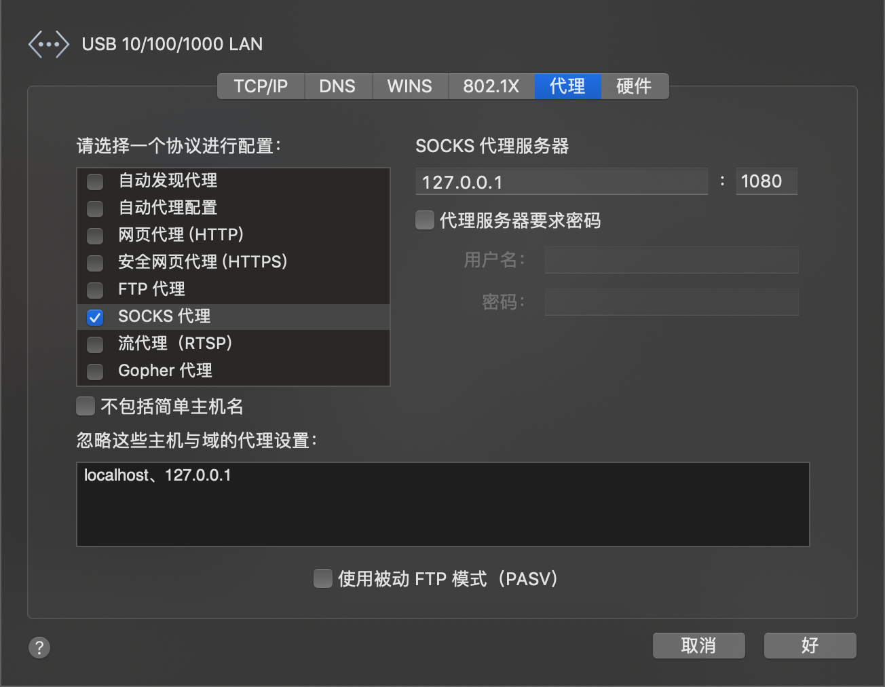

# 使用V2Ray

> 全部内容按照[V2Ray配置指南](https://toutyrater.github.io/)的教程进行，下面实际操作步骤。如果遇到问题可以查看原链接

<!--more-->

## 服务端

### 安装脚本

1. 校验服务端时间与客户端时间，V2Ray对时间的要求很高需要两侧在2分钟之内

   ```shell
   [root@host ~]# date -R
   Wed, 13 Mar 2019 07:55:01 -0400
   ```

   时区不一样是没关系的，所以比较下服务端和本地的分钟数一样就可以了。

2. 下载安装脚本

   ```shell
   [root@host ~]# wget https://install.direct/go.sh
   --2019-03-13 07:56:52--  https://install.direct/go.sh
   正在解析主机 install.direct (install.direct)... 104.27.175.71, 104.27.174.71, 2606:4700:30::681b:af47, ...
   正在连接 install.direct (install.direct)|104.27.175.71|:443... 已连接。
   已发出 HTTP 请求，正在等待回应... 200 OK
   长度：未指定 [text/plain]
   正在保存至: “go.sh”
   
       [ <=>                                   ] 13,915      --.-K/s 用时 0s
   
   2019-03-13 07:56:52 (36.7 MB/s) - “go.sh” 已保存 [13915]
   ```

3. 运行脚本

   ```shell
   [root@host ~]# bash go.sh
   Installing V2Ray v4.18.0 on x86_64
   Downloading V2Ray: https://github.com/v2ray/v2ray-core/releases/download/v4.18.0/v2ray-linux-64.zip
     % Total    % Received % Xferd  Average Speed   Time    Time     Time  Current
                                    Dload  Upload   Total   Spent    Left  Speed
   100   608    0   608    0     0   1514      0 --:--:-- --:--:-- --:--:--  1516
   100 10.5M  100 10.5M    0     0  7075k      0  0:00:01  0:00:01 --:--:-- 11.6M
   Extracting V2Ray package to /tmp/v2ray.
   Archive:  /tmp/v2ray/v2ray.zip
     inflating: /tmp/v2ray/config.json
      creating: /tmp/v2ray/doc/
     inflating: /tmp/v2ray/doc/readme.md
     inflating: /tmp/v2ray/geoip.dat
     inflating: /tmp/v2ray/geosite.dat
      creating: /tmp/v2ray/systemd/
     inflating: /tmp/v2ray/systemd/v2ray.service
      creating: /tmp/v2ray/systemv/
     inflating: /tmp/v2ray/systemv/v2ray
     inflating: /tmp/v2ray/v2ctl
    extracting: /tmp/v2ray/v2ctl.sig
     inflating: /tmp/v2ray/v2ray
    extracting: /tmp/v2ray/v2ray.sig
     inflating: /tmp/v2ray/vpoint_socks_vmess.json
     inflating: /tmp/v2ray/vpoint_vmess_freedom.json
   PORT:40827
   UUID:505f001d-4aa8-4519-9c54-6b65749ee3fb
   Created symlink from /etc/systemd/system/multi-user.target.wants/v2ray.service to /etc/systemd/system/v2ray.service.
   V2Ray v4.18.0 is installed.
   ```

4. 启动脚本

   ```shell
   [root@host ~]# systemctl start v2ray
   ```

5. 更新(再执行脚本就好了)

   ```shell
   [root@host ~]# bash go.sh
   ```

## 客户端安装

### Mac安装

> 通过homebrew安装，homebrew的安装略过。也可以参考[原链接](https://github.com/v2ray/homebrew-v2ray)

#### Install v2ray-core

> 我在安装的时候失败了，homebrew提示我需要更新xcode。跟着提示走就好

1. add official tap

   ```shell
   brew tap v2ray/v2ray
   ```

2. install v2ray-core

   ```shell
   brew install v2ray-core
   ```

#### Usage

1. 安装之后的配置文件如下对应路径`/usr/local/etc/v2ray/config.json`

   ```javascript
   // Config file of V2Ray. This file follows standard JSON format, with comments support.
   // Uncomment entries below to satisfy your needs. Also read our manual for more detail at
   // https://www.v2ray.com/
   {
     "log": {
       // By default, V2Ray writes access log to stdout.
       // "access": "/path/to/access/log/file",
   
       // By default, V2Ray write error log to stdout.
       // "error": "/path/to/error/log/file",
   
       // Log level, one of "debug", "info", "warning", "error", "none"
       "loglevel": "warning"
     },
     // List of inbound proxy configurations.
     "inbounds": [{
       // Port to listen on. You may need root access if the value is less than 1024.
       "port": 1080,
   
       // IP address to listen on. Change to "0.0.0.0" to listen on all network interfaces.
       "listen": "127.0.0.1",
   
       // Tag of the inbound proxy. May be used for routing.
       "tag": "socks-inbound",
   
       // Protocol name of inbound proxy.
       "protocol": "socks",
   
       // Settings of the protocol. Varies based on protocol.
       "settings": {
         "auth": "noauth",
         "udp": false,
         "ip": "127.0.0.1"
       },
   
       // Enable sniffing on TCP connection.
       "sniffing": {
         "enabled": true,
         // Target domain will be overriden to the one carried by the connection, if the connection is HTTP or HTTPS.
         "destOverride": ["http", "tls"]
       }
     }],
     // List of outbound proxy configurations.
     "outbounds": [{
       // Protocol name of the outbound proxy.
       "protocol": "freedom",
   
       // Settings of the protocol. Varies based on protocol.
       "settings": {},
   
       // Tag of the outbound. May be used for routing.
       "tag": "direct"
     },{
       "protocol": "blackhole",
       "settings": {},
       "tag": "blocked"
     }],
   
     // Transport is for global transport settings. If you have multiple transports with same settings
     // (say mKCP), you may put it here, instead of in each individual inbound/outbounds.
     //"transport": {},
   
     // Routing controls how traffic from inbounds are sent to outbounds.
     "routing": {
       "domainStrategy": "IPOnDemand",
       "rules":[
         {
           // Blocks access to private IPs. Remove this if you want to access your router.
           "type": "field",
           "ip": ["geoip:private"],
           "outboundTag": "blocked"
         },
         {
           // Blocks major ads.
           "type": "field",
           "domain": ["geosite:category-ads"],
           "outboundTag": "blocked"
         }
       ]
     },
   
     // Dns settings for domain resolution.
     "dns": {
       // Static hosts, similar to hosts file.
       "hosts": {
         // Match v2ray.com to another domain on CloudFlare. This domain will be used when querying IPs for v2ray.com.
         "domain:v2ray.com": "www.vicemc.net",
   
         // The following settings help to eliminate DNS poisoning in mainland China.
         // It is safe to comment these out if this is not the case for you.
         "domain:github.io": "pages.github.com",
         "domain:wikipedia.org": "www.wikimedia.org",
         "domain:shadowsocks.org": "electronicsrealm.com"
       },
       "servers": [
         "1.1.1.1",
         {
           "address": "114.114.114.114",
           "port": 53,
           // List of domains that use this DNS first.
           "domains": [
             "geosite:cn"
           ]
         },
         "8.8.8.8",
         "localhost"
       ]
     },
   
     // Policy controls some internal behavior of how V2Ray handles connections.
     // It may be on connection level by user levels in 'levels', or global settings in 'system.'
     "policy": {
       // Connection policys by user levels
       "levels": {
         "0": {
           "uplinkOnly": 0,
           "downlinkOnly": 0
         }
       },
       "system": {
         "statsInboundUplink": false,
         "statsInboundDownlink": false
       }
     },
   
     // Stats enables internal stats counter.
     // This setting can be used together with Policy and Api. 
     //"stats":{},
   
     // Api enables gRPC APIs for external programs to communicate with V2Ray instance.
     //"api": {
       //"tag": "api",
       //"services": [
       //  "HandlerService",
       //  "LoggerService",
       //  "StatsService"
       //]
     //},
   
     // You may add other entries to the configuration, but they will not be recognized by V2Ray.
     "other": {}
   }
   ```

   主要修改”outbounds“下的数据与服务端”inbounds“的数据一致，其他配置可以先不用管，简化之后如下

   ```javascript
   {
     "inbounds": [
       {
         "port": 1080, // 监听端口
         "protocol": "socks", // 入口协议为 SOCKS 5
         "sniffing": {
           "enabled": true,
           "destOverride": ["http", "tls"]
         },
         "settings": {
           "auth": "noauth"  //socks的认证设置，noauth 代表不认证，由于 socks 通常在客户端使用，所以这里不认证
         }
       }
     ],
     "outbounds": [
       {
         "protocol": "vmess", // 出口协议
         "settings": {
           "vnext": [
             {
               "address": "serveraddr.com", // 服务器地址，请修改为你自己的服务器 IP 或域名
               "port": 16823,  // 服务器端口
               "users": [
                 {
                   "id": "b831381d-6324-4d53-ad4f-8cda48b30811",  // 用户 ID，必须与服务器端配置相同
                   "alterId": 64 // 此处的值也应当与服务器相同
                 }
               ]
             }
           ]
         }
       }
     ]
   }
   ```

2. 编写之后可以运行v2ray的服务

   ```shell
   brew services run v2ray-core
   ```

#### 代理

由于v2ray没有很多图形化工具集成功能，所以代理需要手动设置。在上面的配置中我们把客户端的入口设为socks5的协议并监听1080端口在mac上则进行如下配置”系统偏好“->"高级"->"代理"->"勾选SOCKS代理"。



现在就可以使用了。

## TODO
- [ ] 补全Windows及Android的安装方式
- [ ] 动态端口设置(最近封杀端口很多)
- [ ] 其他高级配置功能